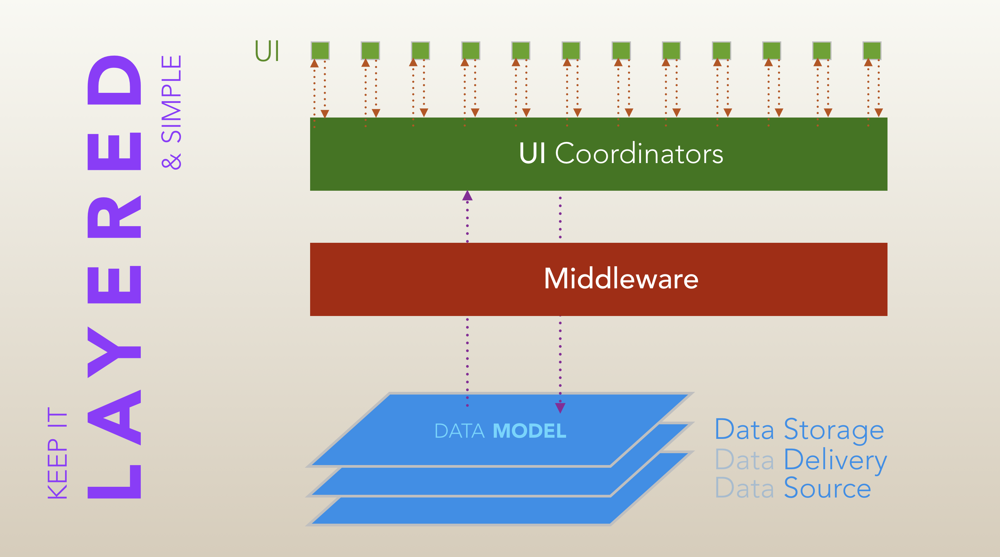

Napomena: ovaj predlog je nastao na osnovu analize postojeće Shop app, početkom aprila 2019-e.

# AnnanowShop app: predlog arhitekture

Preferirani pristup za izradu bilo koje aplikacije se zasniva na načelu:

> You get to a complex project that works by first building one or more simpler projects that work. 

U kontekstu arhitekture aplikacije, to znači da se aplikacija rasparča na manje celine, koje se mogu nezavisno:

- kreirati
- razvijati
- testirati

U idealnoj implementaciji, moguće je izvući bilo koji pod-sistem aplikacije u prazan projekat i isti se, uz sitan utrošak vremena, može pokrenuti. Ideal je jedno, praksa drugo, no vredi imati na umu prilikom rada.

AnnanowShop arhitektura se bazira na *Layered (aka* KILS[^1]) pristupu. 



Ovaj dokument sadrži predlog na osnovu tog primera i praktičnih iskustava sa drugih (znatno kompleksnijih) projekata gde je ovaj pristup uspešno implementiran.

## Podsistemi

Sledi predlog za celine koje identifikujem kao potrebne u AnnanowShop. Obzirom na vrlo kratko vreme, moguće da sam prevideo potrebu za još nekim modulom.

**Data Model** i kod koji ga konvertuje iz JSON-a u objekte deluje sasvim ok. Obzirom da su neki od model objekata suštinski iste stvari kroz razne aplikacije, ima smisla obratiti pažnju da se recimo jedan te isti `Order.swift` fajl može koristiti u svakoj do aplikacija, bez posebnih izmena.

**AnnanowService** je network wrapper za web service sa koga se preuzimaju podaci i na koji se šalju. Spada u Data Delivery layer, pa samim tim ne barata sa model objektima u aplikaciji već isključivo sa Swift standard library tipovima i JSON-om. (Može da koristi Alamofire iza scene mada iskreno ne vidim zašto bi bio neophodan.) Takođe interno handluje OAuth2. Ovaj modul treba pisati tako da je deljiv kroz sve aplikacije, jer je (pretpostavljam) back-end service jedan te isti. To onda omogućava da se od njega u nekom momentu napravi framework i kao takav se samo linkuje u sve Annanow aplikacije.

**DataManager** (spada u Data Storage layer) je modul koji prihvata JSON i konvertuje ga u model objekte. Takođe radi konverziju i u drugom smeru – konvertuje model objekte u JSON koji AnnanowService razume. Ovo je modul gde bi se implementirao Realm, Core Data ili neki sličan persistence sloj (ako za tim ima potrebe). Ovaj modul je _stateless_, svaki method ima ulaz i izlaz (tj. nema transakcija između public metoda) i svaki method je nezavisan od ostalih.

**PushNotificationManager** preuzima od AppDelegate sve što stiže od APNs servera (device token i same UNNotification objekte) i onda dalje radi sa tim šta god treba. Rutira pristigle notifikacije prema middleware ili UI-ju.

Ovde sada dolazi i serija raznih wrappera za 3rd-party service, tipa GooglePlaces, Firebase i šta god. Sve što sa tim modulima komunicira se zapakuje u lokalni XXManager (ili kako već se nazove) čime se integracija sa tim servisima “sakrije” i može se kasnije menjati ako se pronađe bolji servis. 

Primer: _SwiftyBeaver_, _Google Analytics_, _CleanroomLogger_ i slični servisi se mogu relativno lako sakriti  kroz jednu jedinu globalnu funkciju tipa:

```swift
func log(level: LogLevel, 
	message: @autoclosure () -> Any, 
	_ path: String = #file, 
	_ function: String = #function, 
	line: Int = #line) 
{
		//	by default, it logs:
		//	* level
		//	* supplied message
		//	* path for the file
		//	* calling function
		//	* line number
}
```

I onda unutar ovoga pozivaš 3rd-party frameworks, koliko god njih ti treba. Ostatak app pojma nema da to uopšte postoji niti ga zanima. 

(Ovo je po ugledu na `NSLocalizedString()` koji na taj način sakriva implementaciju sistema prevođenja).

### Middleware 

...moduli su *stateful* objekti, mali i strogo fokusirani. Nemaju svoj *persistence storage* i sve što im treba drže u memoriji. Ako išta mora da se čuva između 2 startovanja app, to proslede DataManageru da “snimi” i traže od njega pri sledećem startovanju. Keširaju informacije koje su stigle od DataManagera, po potrebi (primer: sadržaj raznih drop-down listi).

**AccountManager** zavisi od DataManagera i od njega dobija gotove objekte. Njegova namena je da čuva instancu ulogovanog korisnika i sve objekte i informacije vezane za njega. 

**OrderManager** čuva informacije o trenutno aktivnom orderu koji se priprema u shopu. Ili više njih, ako takva mogućnost postoji. Takođe komunicira sa 3rd party servisima koji se tiču Ordera (recimo komunikacija sa Google Places).

Nisam siguran od čega tačno zavise kodne liste tipa Shops, Branches, Insurances itd, pa ne znam u koji od ova dva modula bi trebalo da se smeste. 

Cilj ka kome se teži jeste da UI segment komunicira isključivo sa middleware objektima i ni sa čim drugim u aplikaciji. To oslobađa data module i omogućava njihov razvoj nezavisno od promena UI-a.

## UI segment

**ApplicationCoordinator** se kači na AppDelegate i predstavlja glavnu skretnicu u aplikaciji. On referencira, tj. čuva instance AnnanowService, DataManager, AccountManager itd, skupljene sve zajedno u jedan zajednički struct, `AppDependency`.

Od ostalih, tzv. _content_ Coordinatora, za sada prepoznajem potrebu za:

* **AccountCoordinator** (login, terms, register?)
* **OrderCoordinator** (list, pending, create, confirm, map)
* **MessagingCoordinator** (message, chats)

Ovo je modelirano prema ova tri taba koje vidim u aplikaciji sada. Generalno, tu nema mnogo pravila već se ekrani (UIVC) i njihove grupe (Coordinator) kreiraju po potrebi, prebacuju iz jednog u drugi segment itd.

Što se tiče pojedinačnih ekrana (`UIViewController`), za svaki mora da se kreira `DataSource` objekat i da mu se dodeli kao property. UIVC nema nikakav drugi _dependency_ sem tog jednog data model/source objekta. 

Primer: `CreateOrderViewController` ima jedan property tipa `OrderCreationDataSource` i od njega dobija sve informacije potrebne za prikaz forme. Instancu `OrderCreationDataSource` kreira `OrderManager` (koji ako je potrebno, to traži od DataManagera) i dodeljuje je `CreateOrderViewController`-u nakon što ga instancira.

UIVC nikada sam ne poziva networking, nikada ne instancira druge UIVC objekte (sem ako su embedovani, tj. child VCs) i uvek:

* šta god da mu treba za view-ove, to traži od DataSource objekta
* šta god da je akcija na viewovima, to se prosledi ili nazad DataSource objektu ili “na gore” prema Coordinatoru kome pripada.

Sa ovakvim pristupom je relativno lako pripremiti mock-DataSource objekte i samim tim se mogu pisati testovi za svaki od UIVC-ova bez da  se uopšte instanciraju AccountManager, OrderManager itd.

Kompletna interna implementacija UIVC-a je sakrivena - sve kontrole, tabele, šta god. Svaki `@IBOutlet` i `@IBAction` je private, ama baš sve. Jedini public property su spomenuti dataSource i vrlo izuzetno još po nešto ukoliko je neophodno jer tako iOS SDK zapoveda. Po defaultu - svaki property je `private`, svaki UIVC subclass je `final`, pa se to menja smo ako baš mora.

Cilj: bilo koji UIVC je moguće izvući u poseban prazan projekat i menjati njegovu funkcionalnost uz samo jedan dependency: njegov DataSource parnjak. Bilo koji UIVC je moguće postaviti kao prvi ekran u  aplikaciji.

Istovremeno, DataSource objekat treba pisati tako da je baratanje podacima unutar njega moguće bez postojanja UIVC instance (unutar njega, UIVC je `weak var`).

### Biznis logika

Bitan segment stabilnosti aplikacije jeste da se “odoli” izazovu da UI implementira logiku aplikacije. Tipičan primer u Shop app jeste kreiranje ordera; gde CreateOrderViewController kreira Order objekat, popunjava podatke, dohvata sve što je neophodno, a onda šalje to na servis i obrađuje rezultat.

UI je krhka stvar; često se pokaže potreba da je potreban prikaz novog UIVC-a. Pa onda moraš negde da prebacuješ Order da bi prikazao privremeno taj novi UIVC, pa back ili dismiss da se vratiš nazad i tu se često stvari zakomplikuju dosta i vode problemima.

*Middleware moduli su oni koji implementiraju biznis logiku.* Oni

* implementiraju transakcije i 
* čuvaju trenutno stanje objekta koji se popunjava kroz više faza

UIVC dobija trenutno stanje Ordera kao ulaz, popuni svoj deo i zatim kad i kako god da treba da se skloni sa ekrana, to ne radi UIVC sam već prosledi svom Coordinatoru šta god je uradio sa Orderom a onda Coordinator to prosledi middleware objektu i onda nadalje prikaže naredni UI. 

## 3rd party biblioteke i servisi

Svaki eksterni dynamic framework koji se koristi u Swift-based app

* povećava vreme za svaki build / archive / export
* uvećava vreme startovanja aplikacije na telefonu

Stoga ima smisla da se broj istih smanji, koliko god je moguće.

Predlog je da se sitnije biblioteke koda direktno dodaju u projekat; sve što ima manje od 4-5 sitnih fajlova. To uključuje:

* [Coordinator](https://github.com/radianttap/Coordinator)
* potrebni fajlovi iz [Essentials](https://github.com/radianttap/Swift-Essentials) biblioteke, pre svega:
	- [Controllers](https://github.com/radianttap/Swift-Essentials/tree/master/Sources/Controllers)
	- [Views](https://github.com/radianttap/Swift-Essentials/tree/master/Sources/Views)
	- ostalo po potrebi

Ostatak može kroz CocoaPods ili Carthage.


[^1]: Keep It Layered & Simple